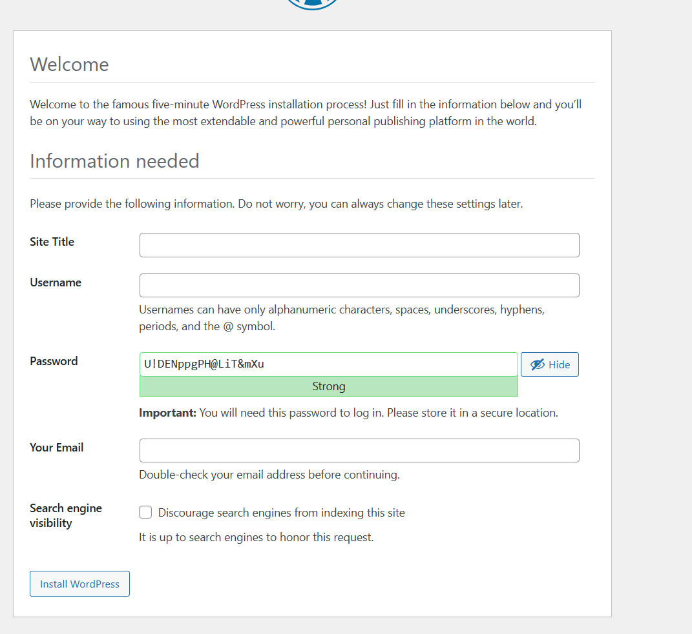

# WEB SOLUTION WITH WORDPRESS

- As you continue learning how to build and manage web solutions using different technologies, you will often come across **PHP-based applications**. PHP is still one of the **most widely used programming languages for websites.**

- In this project, your task is to set up storage infrastructure on two Linux servers and deploy a simple web application using **WordPress.**

- **WordPress is a free and open-source content management system (CMS)** that is written in **PHP**. It allows people to easily create and manage websites. **WordPress uses MySQL or MariaDB databases to store its data.**

- > Your GOAL in this project is to prepare **THE SERVERS, CONFIGURE THE STORAGE**, and **DEPLOY THE WORDPRESS APPLICATION** so it can run properly.

- **Project 6 consists of two parts:**

1. Configure storage subsystem for Web and Database servers based on Linux OS. The focus of this part is to give you practical experience of working with disks, partitions and volumes in Linux.

2. Install WordPress and connect it to a remote MySQL database server. This part of the project will solidify your skills of deploying Web and DB tiers of Web solution.

- As a DevOps engineer, your deep understanding of core components of web solutions and ability to troubleshoot them will play essential role in your further progress and development.

## Three-tier Architecture

Generally, web, or mobile solutions are implemented based on what is called the **Three-tier Architecture.**

**Three-tier Architecture is a client-server software architecture pattern that comprise of 3 separate layers.**


1. **Presentation Layer (PL)**: This is the user interface such as the client server or browser on your laptop.

2. **Business Layer (BL)**: This is the backend program that implements business logic. Application or Webserver

3. **Data Access or Management Layer (DAL)**: This is the layer for computer data storage and data access. [Database Server](https://www.computerhope.com/jargon/d/database-server.htm) or File System Server such as [FTP server](https://titanftp.com/2018/09/11/what-is-an-ftp-server/), or [NFS Server](https://searchenterprisedesktop.techtarget.com/definition/Network-File-System)

- In previous projects we used ‘Ubuntu’, but it is better to be well-versed with various Linux distributions, thus, for this projects we will use very popular distribution called ‘RedHat’ (it also has a fully compatible derivative – CentOS)
- **Note**: for Ubuntu server, when connecting to it via SSH/Putty or any other tool, we used ubuntu user, but for RedHat you will need to use ec2-user. Connection string will look like `ec2-user@<Public-IP>`. Let us get started!


## Step 1 — Prepare a Web Server

- Launch an EC2 instance that will serve as "Web Server" using RedHat as your OS. Create 3 volumes in the same AZ as your Web Server EC2, each of 10 GiB.

- Learn How to Add EBS Volume to an EC2 instance [here](https://www.youtube.com/watch?v=HPXnXkBzIHw)

**Note**: The EBS created must be named as `/dev/xvdf, /dev/xvdg, /dev/xvdh`.


- Open up the Linux terminal and SSH to begin configuration

- Use `lsblk` command to inspect what block devices are attached to the server.


*if your EC2 instance is a newer generation type (like a t3.micro), AWS runs on their modern Nitro System infrastructure. Nitro handles storage hardware differently than older servers: it automatically exposes all attached EBS volumes as high-speed NVMe devices instead of older virtual IDE/SCSI drives.*

- Notice names of your newly created devices. All devices in Linux reside in /dev/ directory. Inspect it with `ls /dev/` and make sure you see all 3 newly created block devices there – their names will likely be **xvdf, xvdh, xvdg** or **nvme1n1, nvme2n1, nvme3n1**.


- Use `df -h` command to see all mounts and free space on your server


- Use `fdisk` utility to create a single partition on each of the 3 disks `sudo fdisk /dev/xvdf` or `sudo fdisk /dev/nvme1n1`, `sudo fdisk /dev/xvdg` or `sudo fdisk /dev/nvme2n1` and `sudo fdisk /dev/xvdh` or `sudo fdisk /dev/nvme3n1`... follow the step in the image below to create the other disk.


- Use `lsblk` utility to view the newly configured partition on each of the 3 disks


- Install lvm2 package using `sudo yum install lvm2`


- Run `sudo lvmdiskscan` command to check for available partitions


- Use `pvcreate` utility to mark each of 3 disks as physical volumes (PVs) to be used by LVM
```bash
sudo pvcreate /dev/xvdf1
sudo pvcreate /dev/xvdg1
sudo pvcreate /dev/xvdh1
```
OR
```bash
sudo pvcreate /dev/nvme1n1p1
sudo pvcreate /dev/nvme2n1p1
sudo pvcreate /dev/nvme3n1p1
```
- Verify that your Physical volume has been created successfully by running `sudo pvs`


- Use `vgcreate` utility to add all 3 PVs to a volume group (VG). Name the VG webdata-vg
```bash
sudo vgcreate webdata-vg /dev/xvdh1 /dev/xvdg1 /dev/xvdf1
```
OR
```bash
sudo vgcreate webdata-vg /dev/nvme1n1p1 /dev/nvme2n1p1 /dev/nvme3n1p1
```
- Verify that your VG has been created successfully by running `sudo vgs`


- Use `lvcreate` utility to create 2 logical volumes. **apps-lv (Use half of the PV size), and logs-lv Use the remaining space of the PV size. NOTE:** apps-lv will be used to store data for the Website while, logs-lv will be used to store data for logs.
```bash
sudo lvcreate -n apps-lv -L 14G webdata-vg; sudo lvcreate -n logs-lv -L 14G webdata-vg
```
- Verify that your Logical Volume has been created successfully by running `sudo lvs`


- Verify the entire setup
```bash
sudo vgdisplay -v #view complete setup - VG, PV, and LV
```


- `sudo lsblk`


- Use **mkfs.ext4** to format the logical volumes with ext4 filesystem
```bash
sudo mkfs -t ext4 /dev/webdata-vg/apps-lv; sudo mkfs -t ext4 /dev/webdata-vg/logs-lv
```


- Create **/var/www/html** directory to store website files
```bash
sudo mkdir -p /var/www/html
```
- Create **/home/recovery/logs** to store backup of log data
```bash
sudo mkdir -p /home/recovery/logs
```
- Mount **/var/www/html on apps-lv** logical volume
```bash
sudo mount /dev/webdata-vg/apps-lv /var/www/html/
```
- Use `rsync` utility to back up all the files in the log directory **/var/log** into **/home/recovery/logs** (This is required before mounting the file system)
```bash
sudo rsync -av /var/log/. /home/recovery/logs/
```


- Mount **/var/log on logs-lv** logical volume. (Note that all the existing data on /var/log will be deleted. That is why step 15 above is very important)
```bash
sudo mount /dev/webdata-vg/logs-lv /var/log
```
- Restore log files back into **/var/log** directory
```bash
sudo rsync -av /home/recovery/logs/. /var/log
```


- Update /etc/fstab file so that the mount configuration will persist after restart of the server.

- The UUID of the device will be used to update the **/etc/fstab** file; `sudo blkid`


- Find the **2 lines** starting with `/dev/mapper/webdata`, and copy the long alphanumeric string inside the `UUID="..."` quotation marks for each, without including the quotes themselves.

- Update **/etc/fstab** in this format using your own UUID and rememeber to remove the leading and ending quotes.
```bash
sudo vi /etc/fstab
```


- Test the configuration and reload the daemon
```bash
sudo systemctl daemon-reload
```
- Verify your setup by running `df -h`, output must look like this:


## Step 2 — Prepare the Database Server
- Launch a second RedHat EC2 instance that will have a role – ‘DB Server’ Repeat the same steps as for the Web Server, but instead of `apps-lv` create `db-lv` and mount it to `/db` directory instead of `/var/www/html/`.

- for more clarification, step 2 is telling you to repeat same thing you did in step 1 with a little change stated in step 2 above,

1. Create a RedHat EC2 instance assign to DB Server

2. Create 3 volume with 10GB with the same AZ with your DB Server and attach them to your DB Server as **/dev/xvdf, /dev/xvdg, /dev/xvdh**

3. Connect to DB Server (ssh -i key.pem ec2-user@DB_SERVER_IP)

4. Check disks `lsblk`

5. Partition the Disks `sudo fdisk /dev/xvdf`, then press: **n, p, 1, enter, enter, w**.... Repeat for the rest disk **/dev/xvdg, /dev/xvdh**

6. Install LVM: `sudo yum install lvm2 -y`

7. Create Physical Volumes: `sudo pvcreate /dev/xvdf1 /dev/xvdg1 /dev/xvdh1`

8. Create Volume Group: `sudo vgcreate webdata-vg /dev/xvdf1 /dev/xvdg1 /dev/xvdh1`

9. Create Logical Volume `sudo lvcreate -n db-lv -L 20G webdata-vg`

10. Format the Volume `sudo mkfs.ext4 /dev/webdata-vg/db-lv`

11. Create Mount Directory `sudo mkdir /db`

12. Mount the Volume `sudo mount /dev/webdata-vg/db-lv /db` and Verify with `df -h`

13. Install database software on the DB Server: `sudo yum update; -y sudo yum install mariadb-server -y`

14. Start the database service: `sudo systemctl start mariadb`

15. Enable it on boot: `sudo systemctl enable mariadb`

16. Check status: `sudo systemctl status mariadb`


## Step 3 — Install WordPress on your Web Server EC2

- Update the repository `sudo yum -y update`


- Install wget, Apache and it’s dependencies:
```bash
sudo yum -y install wget httpd php php-mysqlnd php-fpm php-json
```


- Start Apache: `sudo systemctl enable httpd; sudo systemctl start httpd`

- To install PHP and its depemdencies:
```bash
sudo yum install https://dl.fedoraproject.org/pub/epel/epel-release-latest-8.noarch.rpm
sudo yum install yum-utils http://rpms.remirepo.net/enterprise/remi-release-8.rpm
sudo yum module list php
sudo yum module reset php
sudo yum module enable php:remi-7.4
sudo yum install php php-opcache php-gd php-curl php-mysqlnd
sudo systemctl start php-fpm
sudo systemctl enable php-fpm
setsebool -P httpd_execmem 1
```


- Restart Apache: `sudo systemctl restart httpd`

- Download wordpress and copy wordpress to **var/www/html:**
```bash
mkdir wordpress
cd   wordpress
sudo wget http://wordpress.org/latest.tar.gz
sudo tar xzvf latest.tar.gz
sudo rm -rf latest.tar.gz
sudo cp wordpress/wordpress/wp-config-sample.php wordpress/wp-config.php
sudo cp -R wordpress/wordpress/. /var/www/html/
```


- Enter the commands below in the wordpress directory
```bash
sudo cp wordpress/wp-config-sample.php wordpress/wp-config.php
sudo cp -R wordpress/. /var/www/html/
```


- Configure SELinux Policies:
```bash
sudo chown -R apache:apache /var/www/html/
sudo chcon -t httpd_sys_rw_content_t /var/www/html/wordpress -R
sudo setsebool -P httpd_can_network_connect=1
 sudo setsebool -P httpd_can_network_connect_db 1
```

## Step 4 — Install MySQL on your DB Server EC2

- `sudo yum update`

- Verify that the service is up and running by using: `sudo systemctl status mariadb`.

- if it is not running, restart the service and enable it so it will be running even after reboot:
```bash
sudo systemctl restart mariadb; sudo systemctl enable mariadb
```


## Step 5 — Configure DB to work with WordPress

- `sudo mysql`
- `CREATE DATABASE wordpress;`
- `CREATE USER `myuser`@`<Web-Server-Private-IP-Address>` IDENTIFIED BY 'mypass';`
- `GRANT ALL ON wordpress.* TO 'myuser'@'<Web-Server-Private-IP-Address>';`
- `FLUSH PRIVILEGES;`
- `SHOW DATABASES;`
- then `exit`

**Note:** make sure the IP you add in CREATE USER is that of your Web Server.


## Step 6 — Configure WordPress to connect to the remote database.

- **Hint:** Do not forget to open MySQL port 3306 on DB Server EC2. For extra security, you shall allow access to the DB server **ONLY** from your Web Server’s IP address, so in the Inbound Rule configuration specify source as /32


- Install MySQL client and test that you can connect from your Web Server to your DB server by using **mariadb-client** `sudo yum install mariadb -y`

- **Allow Remote Database Connections** Edit MariaDB configuration on your DB SERVER: 
```bash
sudo nano /etc/my.cnf.d/mariadb-server.cnf
```
or 
```bash
sudo vi /etc/my.cnf.d/mariadb-server.cnf
```
- Change blind address to `bind-address=0.0.0.0`


- Restart MariaDB: `sudo systemctl restart mariadb`
```bash
sudo systemctl status mariadb
```
- **Note:** Make sure your DB Server security group has port 3306 open and type will be **MySQL/Auora** as seen previously in the image above.

- Confirm MariaDB Is Listening on Port 3306 On the DB Server: `sudo ss -tlnp | grep 3306`


- Restart MariaDB again: `sudo systemctl restart mariadb`

- Then go back to the Web Server: `mysql -h DB_SERVER_PRIVATE_IP -u myuser -p`

- Then type your password

- Then Type `SHOW DATABASE;`


- Try to access from your browser the link to your WordPress `http://<Web-Server-Public-IP-Address>/wordpress/`


- Choose your prefered language above.



- Fill all with the preferred informations


